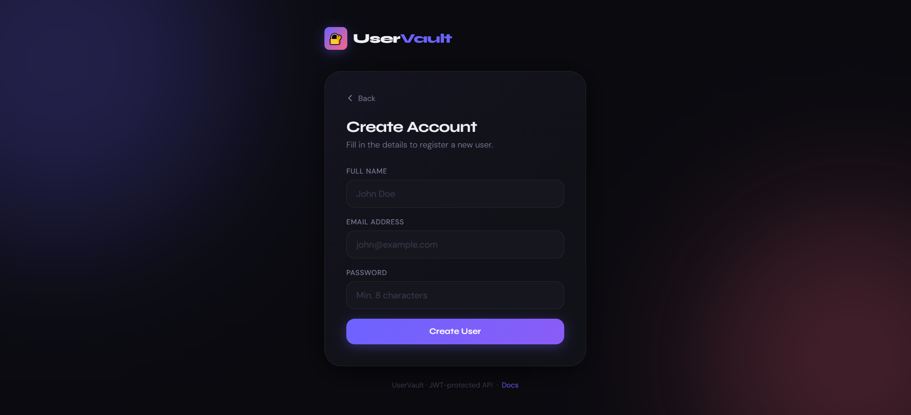
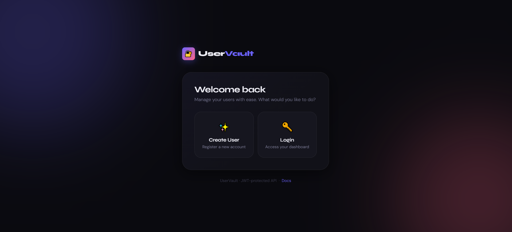
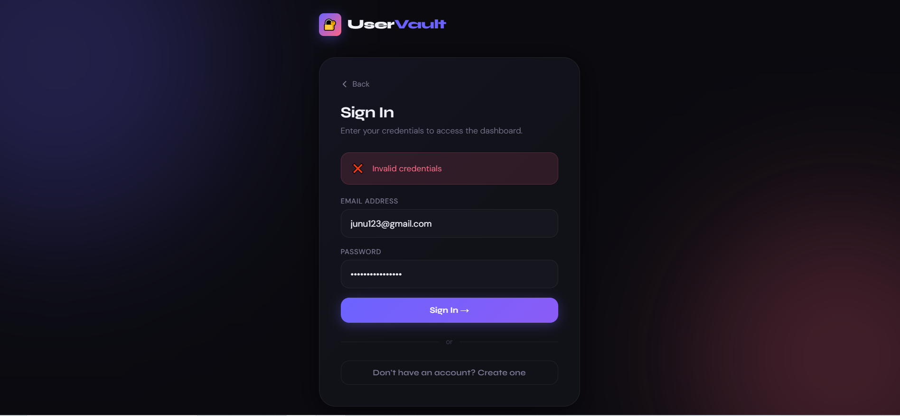
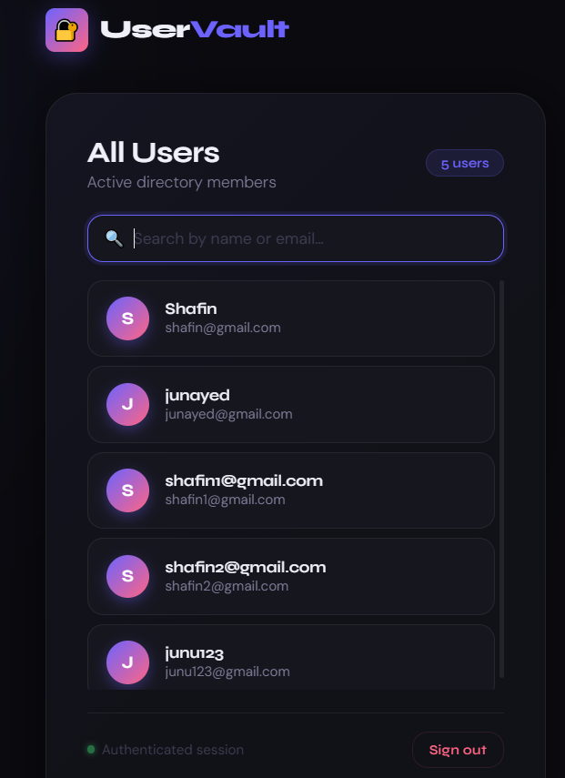

````markdown
 # Node.js CRUD Dashboard with JWT Authentication

A simple and fun Node.js project to **learn CRUD operations, JWT authentication, and frontend integration**. Users can register, login, and view a dashboard with all users. This project also includes fun enhancements like optional avatars, inline edits, and a random user generator.

---

## 🛠 Features

- User registration with hashed passwords (bcrypt)
- User login with JWT authentication
- Protected routes for creating and viewing users
- Dashboard displaying all users
- Separate landing options: Create User / Login User
- Success and error messages
- Optional fun features (can be added later):
  - Random user generator
  - Avatars for each user
  - Inline editing of user details
  - Dark mode toggle
  - Leaderboard / gamification

---

## 💻 Tech Stack

- **Backend:** Node.js, Express.js, MongoDB, Mongoose
- **Authentication:** JWT (JSON Web Token)
- **Password Security:** bcryptjs
- **Frontend:** Simple HTML + JS
- **Development Tools:** Nodemon

---

## 🚀 Installation

1.**Clone the repo:**

```
git clone <your-repo-url>
cd node_js_cicd_crud

````

2. **Install dependencies:**

```bash
npm install
```

3. **Create a `.env` file** in `src/` folder:

```env
PORT=3000
MONGO_URI=mongodb://127.0.0.1:27017/testdb
JWT_SECRET=your_jwt_secret
```

4. **Start the server (development mode):**

```bash
npm run dev
```

5. **Open frontend:**

* Open `frontend/index.html` in your browser
  (or serve it via Express for same-origin requests)

---

## 📁 Project Structure

```
node_js_cicd_crud/
├── src/
│   ├── app.js           # Express app
│   ├── config/
│   │   └── db.js        # MongoDB connection
│   ├── controllers/
│   │   └── user.controller.js
│   │   └── auth.controller.js
│   ├── models/
│   │   └── user.model.js
│   └── routes/
│       └── user.routes.js
│       └── auth.routes.js
├── frontend/
│   └── index.html       # Simple frontend for CRUD + JWT
├── server.js
├── package.json
└── README.md
```

---

## 🔑 How It Works

1. **User Registration**

   * User fills Name, Email, Password
   * Password is hashed with bcrypt
   * Saved in MongoDB with `_id`, `__v`, and timestamps

2. **User Login**

   * User submits email/password
   * Server validates credentials
   * Returns JWT token

3. **Protected Routes**

   * JWT token sent in `Authorization: Bearer <token>` header
   * Server verifies token before giving access
   * Users can view all registered users in dashboard

4. **Frontend**

   * Landing page shows two options: **Create User** or **Login User**
   * Forms appear based on selection
   * Dashboard displays all users after successful login

---

## 📸 Screenshots

Heres are the screenshots :

  

  

  

  


##  Future Enhancements

* Add **inline editing** for users
* Add **delete buttons**
* Add **avatars / profile pictures**
* Add **leaderboard / gamification**
* Dark mode toggle

---
